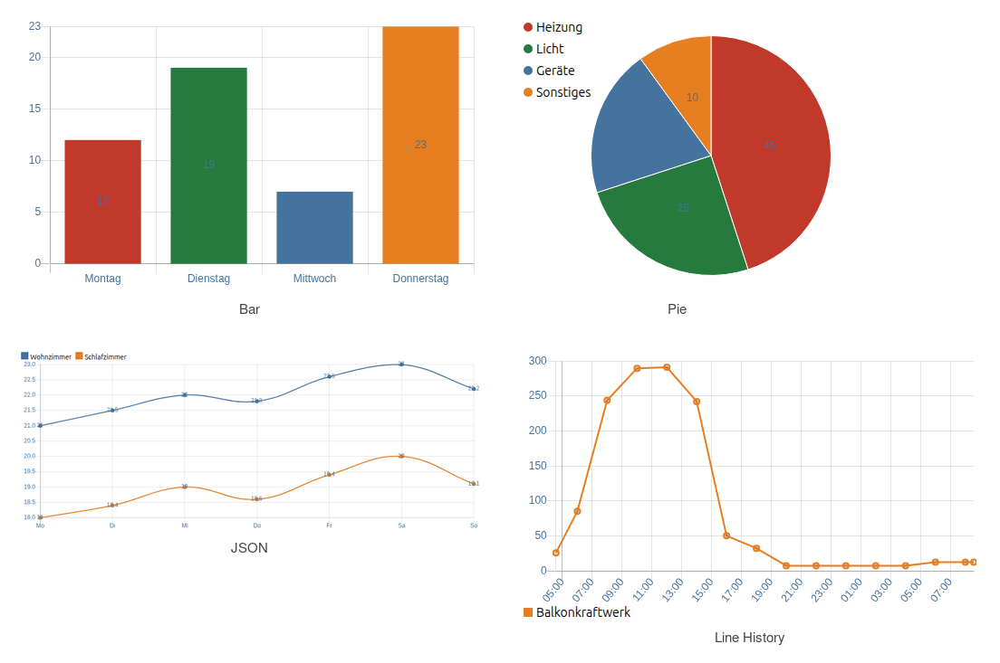

# Charts

[User guide](../README.md) › [Widget catalog](README.md) · [Deutsch](../../de/widgets/charts.md)

Four native VIS 2 charts for different data sources.

## Widgets

- [Bar chart](chart-bar.md) – compare individual current state values.
- [Pie chart](chart-pie.md) – show proportions of individual current state values.
- [JSON chart](chart-json.md) – combine several bar and line datasets from one JSON state.
- [Line history chart](chart-line-history.md) – load time series directly from a history instance.

Bar and Pie can read values from indexed editor datasets or from one shared JSON
state. JSON Chart uses a separate multi-dataset format. Line History queries
historic values through the selected history adapter instance.

## Shared settings

<table>
<tr><td></td>
<td><ul><li><b>Card layout:</b> places the chart and an optional HTML title in a Material Design card.</li><li><b>Color scheme:</b> distributes a palette across datasets without an individual color.</li><li><b>Legend position:</b> top and bottom arrange entries horizontally; left and right arrange them vertically.</li><li><b>Tooltip:</b> shows values when a chart element is touched or hovered.</li></ul></td></tr>
</table>
